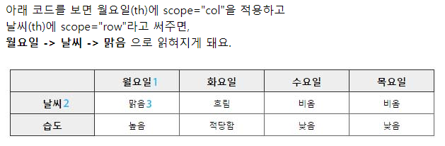
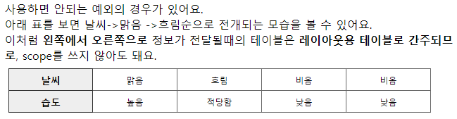

#  table 태그 기본 구조 (접근성, 시맨틱)

- HTML <tbody> 요소는 표의 여러 행(<tr>)을 묶어서 표 본문을 구성합니다.
- `<tr></tr>` = 행
- `<td></td>` = 셀


### [scope]
- 시각장애인들은 웹페이지를 이용할 때 스크린 리더기를 이용합니다. 소리를 통해 듣기 때문에 표 같은 경우는 순서가 가장 중요합니다.
- th가 어떤 td의 제목인지 알려주기 위해서 사용됩니다.
- scope=‘col’ -> 열 / 제목셀에 세로열의 내용과 상관관계 부여
- scope=‘row’ -> 행 / 제목셀에 가로열의 내용과 상관관계 부여
- scope는 행과 열의 구조의 단순한 표일 경우 사용을 하게 되고,
- id, headers는 복잡한 표일 경우 사용합니다.
- `* HTML5에서는 td태그에서 scope 속성이 표준이 아니라는 점 참고




### [id, headers]
- 간단한 표의 경우에는 scope로 충분하지만 표가 복잡해진 경우에 사용합니다.
- 제목에 각각의 id를 부여하고 headers안에 해당하는 id값을 넣어줍니다.
- id를 부여해서 상관관계를 명확히 나타낼 수 있습니다.
  ```
  <th colspan="3" scope="col" id="detail">상세내역</th>
  <tr>
    <td headers="detail">초등학교</td>
    <td headers="detail">중학교</td>
    <td headers="detail">고등학교</td>
  </tr>
  ```


### [table 병합]
- colspan = 가로로 합치는 것, 열(col)들을 병합(span:걸치다)하는 속성입니다.
- rowspan = 세로로 합치는 것, 행(row)들을 병합하는 속성입니다.
- * 이 속성은 th, td에 사용할 수 있으며, 속성 값으로 병합할 셀의 숫자를 적으시면 됩니다.
- 대신 셀 병합을 할 경우, 병합된 개수만큼의 셀은 빼야 합니다.
- ex)` <td colspan="2"></td>`, `<td rowspan="2"></td>`
- 병합을 해도 colgroup의 col수는 병합갯수가 아닌 col의 숫자대로 넣어야 합니다.


### [colgroup / col]
- 테이블(표) 내에서 여러 열의 속성을 한번에 지정할 때 사용하는 <col>태그들을 묶을 때 사용.
- colgroup은 뒤에 나오는 컬럼에 적용할 스타일을 해당 태그에서 미리 적용할 수 있게합니다.
- 병합된 열이 있어도 colgroup의 col수는 병합열의 갯수가 아닌 col의 숫자대로 넣어야 합니다.
- col 속성
    - span : 한번에 속성 지정할 열 개수 별도 지정 안 할 경우 기본값은 1임.
    - width, align, valign, char, charoff는 html5에서 제외
    ```
    <colgroup>
        <col span="한번에 속성 지정할 열 갯수" style="background-color:red">
        <col style="background-color:green">
    </colgroup>
    ```


### [tfoot / tbody]
tbody의 데이터 양이 아주 많고 동시에 이 데이터에 대한 헤딩을 위아래로 나누어 제공할 필요가 있을 때 thead, tbody, tfoot을 사용하여 tr을 그룹핑한다고 볼 수 있습니다.
이렇게 처리하면 tbody만 스크롤링되거나 인쇄 시 매 페이지마다 thead, tfoot을 출력되도록 만들 수 있습니다.

- tfoot은 tbody 데이터 처리를 위해 먼저 이해하는 중요한 테이블 헤딩이므로 먼저 읽는 것이 더 논리적이며,
- tbody가 비정상적으로 긴 경우, tfoot을 나중에 읽게 되면 맥락을 부여하기 어려워 테이블의 데이터를 전체적으로 파악하기 어려워 질 수 있습니다.
- 웹 접근성에서 의미하는 선형화(논리적 순서)는 마크업 순서가 아닌 의미적 순서(이해에 도움되는 순서)로 보시는 것이 더 나을 듯 싶습니다.
- 따라서 tfoot을 tbody보다 먼저 두는 웹 표준과 웹 접근성은 충돌되지 않는다고 봅니다.


### [table summary / caption]
- caption은 표의 제목을 보여주는 태그혹은 설명에 쓰입니다. 필수는 아니지만 웬만하면 명시하는 것을 권고하고 있습니다.
- caption="테이블제목 + 요약정보"<br>
    (참고 : 요약정보가 너무 길 경우에는 strong 태그 등을 이용하여 따로 담아줍니다. 그러면 스크린리더 사용자가 방향키를 눌러 다음으로 넘길 수 있습니다.)
- summary는 표의 전체적인 내용을 요약해줄 때 사용합니다. html5 에서는 사용하지 않습니다.

### [scope="rowgroup" / scope="colgroup" ]


### [table summary / caption]
- summary는 col또는 row에 나온 순으로 넣어주고 caption은 table의 제목을 넣어준다. 
