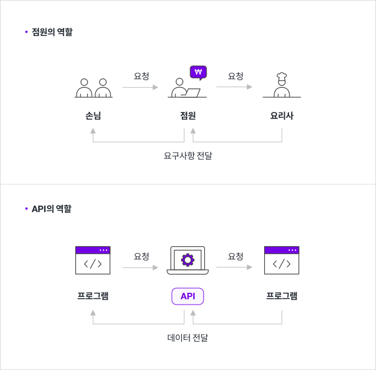

# API(Application Programming Interface)

- 코드들끼리 서로 소통하기 위해 만들어진 것 / 서버와 소통할 수 있는 키보드 같은 인터페이스 쉽게 말해 프로그램간 커뮤니케이션을 담당하는 기능입니다.

- API를 본격적으로 알아보기 전에, 비유를 들어 쉽게 설명을 도와드리겠습니다. 여러분이 멋진 레스토랑에 있다고 가정해봅시다. 점원이 가져다준 메뉴판을 보면서 먹음직스러운 스테이크를 고르면, 점원이 주문을 받아 요리사에 요청을 할 텐데요. 그러면 요리사는 정성껏 스테이크를 만들어 점원에게 주고, 여러분은 점원이 가져다준 맛있는 음식을 먹을 수 있게 됩니다. 
여기서 점원의 역할을 한 번 살펴보겠습니다. 점원은 손님에게 메뉴를 알려주고, 주방에 주문받은 요리를 요청합니다. 그다음 주방에서 완성된 요리를 손님께 다시 전달하지요. API는 점원과 같은 역할을 합니다. 
API는 손님(프로그램)이 주문할 수 있게 메뉴(명령 목록)를 정리하고, 주문(명령)을 받으면 요리사(응용프로그램)와 상호작용하여 요청된 메뉴(명령에 대한 값)를 전달합니다.
쉽게 말해, API는 프로그램들이 서로 상호작용하는 것을 도와주는 매개체로 볼 수 있습니다.

## API의 역할은? 

1. API는 서버와 데이터베이스에 대한 출입구 역할을 한다. 
: 데이터베이스에는 소중한 정보들이 저장되는데요. 모든 사람들이 이 데이터베이스에 접근할 수 있으면 안 되겠지요. API는 이를 방지하기 위해 여러분이 가진 서버와 데이터베이스에 대한 출입구 역할을 하며, 허용된 사람들에게만 접근성을 부여해줍니다.

2. API는 애플리케이션과 기기가 원활하게 통신할 수 있도록 한다. 
: 여기서 애플리케이션이란 우리가 흔히 알고 있는 스마트폰 어플이나 프로그램을 말합니다. API는 애플리케이션과 기기가 데이터를 원활히 주고받을 수 있도록 돕는 역할을 합니다.

3. API는 모든 접속을 표준화한다. 
API는 모든 접속을 표준화하기 때문에 기계/ 운영체제 등과 상관없이 누구나 동일한 액세스를 얻을 수 있습니다. 쉽게 말해, API는 범용 플러그처럼 작동한다고 볼 수 있습니다.

## API유형은 어떤게 있을까?
 
1. private API 
: private API는 내부 API로, 회사 개발자가 자체 제품과 서비스를 개선하기 위해 내부적으로 발행합니다. 따라서 제 3자에게 노출되지 않습니다.

2. public API 
: public API는 개방형 API로, 모두에게 공개됩니다. 누구나 제한 없이 API를 사용할 수 있는 게 특징입니다.

3. partner API 
:partner API는 기업이 데이터 공유에 동의하는 특정인들만 사용할 수 있습니다. 비즈니스 관계에서 사용되는 편이며, 종종 파트너 회사 간에 소프트웨어를 통합하기 위해 사용됩니다.

참고 포스팅 : https://steemit.com/kr/@yahweh87/it-api