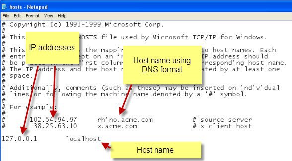
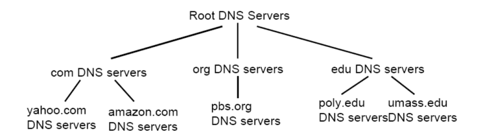

# Windows Hosts(호스트) 파일이란?


출처: https://goddaehee.tistory.com/90?category=281064 [갓대희의 작은공간]

## Host(호스트)란?<br>
    * 호스트 이름에 대응하는 IP 주소가 저장되어 있어서 도메인 이름 시스템(DNS)에서 주소 정보를 제공받지 않고도 서버의 위치를 찾게 해주는 파일.

	1. 웹개발을 하면서 호스트 파일(Host file)을 많이 활용하게 된다. 호스트 파일의 역할은 무엇일까? <br>
        네이버를 예를 들어보자. 일반적으로 IP주소보단 http://www.naver.com이라는 도메인 주소를 외우기 쉽다.
        그렇기 때문에 우리는 http://www.naver.com라는 도메인 이름을 주소창에 입력하여 접속한다.
        도메인 이름을 주소창에 입력하지만 실제로 우리가 접속하는 서버의 주소는 아이피 주소이다.

	2. 호스트 파일을 문서 편집기로 열었을때의 모습


        호스트 파일을 수정할 때에는  IP주소, 호스트 이름을 적어주면 적용되고 127.0.0.1은 기본적으로 자신의 컴퓨터 서버이다. 이를 응용하여 해커들이 해킹에도 아주 많이 응용된다. http://www.naver.com의 호스트를 특정 해킹 페이지의 IP로 지정하게되면 우리가 http://www.naver.com 으로 접속하려 할 때 해커들이 만든 naver.com으로 접속하게 되는 방식이다.

## 정리

▶ 호스트파일의 역할

    - 호스트 이름에 대응하는 IP 주소가 저장되어 있어서 도메인 이름 시스템(DNS)에서 주소 정보를 제공받지 않고도 서버의 위치를 찾게 해준다.

▶ 호스트 파일 사용 장점

    - 인터넷 속도 향상
    - 리소스 사용을 줄임
    - 보안 문제 예방적 대처

▶ 호스트 파일 사용 단점

    - 사이트 방문이 차단될 수 있다
    - 페이지 내에서 부분 차단된 경우 디자인, 속도 문제

▶ 호스트 파일 저장 위치

    C:\windows\system32\drivers\etc\hosts

▶ 호스트 파일 작성 원칙

    - 샵 기호(#)로 시작하는 줄(line)은 주석문, 개별 줄(line) 앞이나 호스트 이름 다음에 작성
    - 각 항목은 한 줄(line)로 작성
    - 항목은 IP 주소 + 호스트 이름 순서로 제한
    - 호스트 이름과 IP 주소의 간격은 최소한 1칸을 띄움
    - 호스트 이름 부분에 'IP 주소' 등록 제한 : 호스트의 IP 주소 검색이 목적. IP 주소를 이미 찾은 상태
    - 호스트 이름의 글자수는 255자로 제한
    - 프로토콜 형식 'http:', 와일드카드 문자 '*', 주소 맨끝에 사선기호 '/' 사용 제한

## Domain & IP

▶ Domain & IP 기본 개념

    - 우리가 어떤 홈페이지를 들어가기 위해서는 ip주소가 필요하다.
    이전에 배웠던 ip는 2진수 32자리의 네트워크 주소이다.
    네이버 홈페이지를 들어가고 싶다면 네이버의 ip주소 32자리를 입력하고 접속해야 한다.
    그러나 개개인이 자주 들어가는 홈페이지 ip주소를 모두 외우기에는 어려움이 따른다.그래서 만든것이 Domain주소이다. 우리가 알고있는 www.naver.com 처럼 ip주소를 외우기 쉽게, 보기 쉽게 번역한 주소이다.

▶ DNS Server<BR>

    - 우리가 주소창에 접속하고 싶은 domain 주소를 입력하면실제 ip주소를 알려주는 역할을 한다.



- dns 서버에 가장 위에 있는 것은 root dns 서버이다. root dns 서버는 com , org , edu , net 등 domain 주소 가장 마지막에 있는 주소의 ip를 관리한다.
<BR>
- 또한 com nds 서버는 여러개의 dns주소를 관리 한다. 우리가 알고 있는 naver , yahoo 등 com으로 끝나는 주소들은 com dns 서버가 ip를 갖고 있으며 관리한다. 관리하는 대상이 있는경우의 dns 서버를 책임 dns 서버라고 한다. (우리가 연결한 dns - rocal dns 서버)
<BR>

- rocal dns 서버는 우리가 사용하는 dns 서버를 말한다. 모든 nds서버를 사용가능하지만, 가장 가까이 위치해있는 서버를 사용하여야 통신이 빠르다.<br>
- 사용자가 주소창에 www.naver.com을  입력하면  네이버 홈페이지 창을 띄우는 과정까지는 다음과 같다.

    1. www.naver.com 입력
    2. 연결되어있는 dns 서버가 우연히 naver.com 이라면 바로 사용자에게 알려줄 수 있다.
    3. 그러나 그런 경우는 매우 드물기 때문에 root dns 서버에게 com dns 서버의 주소를 물어본다.
    4. root dns 서버에게 받은 com에게 찾아가 naver.com의 주소를 물어본다.
    5. com에게 받은naver.com에게 찾아가 www.naver.com의 주소를 물어본다.

- www.naver.com의  ip주소를 알고 있는 naver.com dns 서버는 rocal dns 서버에게 주소를 알려주고 rocal nds 서버는 사용자에게 다시 알려주게 된다. 마침내 www.naver.com의 ip 주소를 얻은 사용자는 접속하여 서버에게 네이버 페이지를 불러올 수 있다.

<BR>
- 따라서 다른 사람들이 domain 주소를 통하여 내가 만든 페이지를 불러오게 하고 싶다면 해당 dns 서버에 등록을 해야한다.  이 등록과정에서 약간의 비용이 발생하게 된다.


## 내부접속과 외부접속의 의미

1. 웹 브라우저는 웹 페이지를 보고자 요청한 현재 컴퓨터의 IP 주소와 주소 창에 입력된  ****.com 이라는 도메인을 갖고 자신의 컴퓨터 LAN 카드를 통해 인터넷 상에서 DNS(Domain Name System) 서버를 찾게 됩니다.<br>
2. DNS 서버를 찾게 되면 그 서버에 구축되어 있는 데이터베이스에서 ****.com 에 해당하는 IP 주소를 얻고, 그 곳에서 얻은 IP 주소로 해당하는 컴퓨터를 찾아 갑니다.<br>
3. 찾아간 컴퓨터에 웹 서버가 설치되어 있으면 http:// www.****.com/이라고만 입력했으므로 홈 디렉터리에 있는 디폴트 파일(index.php)을 찾아 웹 서버에서 PHP 언어를 해석하여 웹페이지를 만든 후<br>
4. 그 웹 페이지를 보고자 요청했던 컴퓨터로 다시 보내주면 웹 페이지를 받은 컴퓨터의 웹 브라우저가 보여주게 되는 것입니다. <br>
(이렇듯 PHP 코드는 웹 서버에서 해석하여 웹 브라우저에 보내주므로 사용자의 웹 브라우저에서는 그 PHP 소스 코드를 알 수가 없습니다.)<br>
그러니까, http://localhost/라고 입력했을 때는 IP 주소가 127.0.0.1로 예약되어 있어서 2와 3항의 과정은 생략되고 곧 바로 자신의 컴퓨터 웹 서버로 가게 되기 때문에 내부접속이라 했으며, http://localhost/를 입력해서는 외부에서 즉 다른 컴퓨터에서 웹 서버에 접속이 되는지 확인할 수가 없습니다.
```
[참고] 일반적으로 웹 서버에서 localhost는 IP Address 127.0.0.1(loop-back address)로 예약되어 있으며, 자신의 컴퓨터를 가리키는 가상 IP Address로써 실제 IP Address와 같은 동작을 합니다.<br> 좀 더 쉽게 말하자면 http://localhost/는 localhost라는 도메인을 찾으러 외부 DNS 서버로 나가는 것이 아니라 127.0.0.1이라는 IP 주소를 가리키고 있는 것이므로 곧 바로 자신의 컴퓨터를 찾아가는 것입니다. loop-back address라 하는 의미를 아시겠지요?
```

<br> 그에 반해 http://jobdahan.dnip.net/이라고 도메인을 사용하여 입력했을 때는 위에서 설명한 것 처럼 외부로 나갔다가 다시 찾아오는 과정을 거치므로 외부접속이라는 표현을 하게 된 것입니다.
<br> s이러한 흐름의 개념은 서버 운영 뿐만이 아니라 웹 프로그래밍할 때 알아야 되는 기본 개념이므로 잘 이해하고 계시기 바랍니다

출처: https://prometheus.tistory.com/entry/내부접속localhost와-외부접속의-의미 [Prometheus]


```
어제 얘기했던 내용입니다.

첫번째 localhost 설정
다빈씨가 개인 컴에서 보려는 localhost 설정하세요.
저는
http://localhost:8585 이렇게 설정되어 있고 다른 사람들은
http://218.153.37.181:8585/
이렇게 접속해서 볼 수 있는거에요.

두번째 폴더 공유하기 - localhost로 설정한 폴더
https://studyforus.tistory.com/82
중간에 사용자 추가는 Everyone 으로 하시면 됩니다.

세번째 인바운드 설정
https://m.blog.naver.com/zeboll/221134011377

해보시고 잘 안되면 물어보세요
```