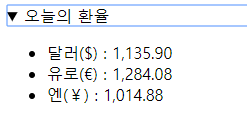

# 그룹핑(Grouping) 요소
- grouping content 는 무엇인가를 감싸는 경우에 사용되는데 이 중에 address, pre 요소에 대해 알아보겠습니다.

#### `<address></address>`
- 사람(들), 조직(기업)에 대한 정보를 제공하고자 하는 경우에 사용합니다.
즉, 물리적인 주소, digital location, contact information(연락처 정보)을 제공할 때 사용

#### `<pre>`
- 지정된 텍스트 서식 보존 요소(pre-formatted text, preserved text) 코드의 공백이나 줄바꿈 등의 공백,여백 등을 보존하도록 해주는 요소입니다.
- 이메일, 빈 줄이 표시된 단락, 글 머리표가 붙은 줄로 표시된 목록 등에 사용
- 컴퓨터 코드(언어) 표시 목적으로 사용, ASCII 아트 표시, 컴퓨터 코드, 출력, 키보드 블럭을 나타내기 위해 pre 요소는 code, samp, kbd 요소와 함께 사용 가능합니다.
```
<pre>
pre 요소 내의 텍스트는
고정폭 글꼴(fixed-width font)을 사용하여 표현되며,
사용된      띄어쓰기와      줄바꿈이 모두 그대로

브라우저 화면에 나타납니다.
</pre>
```
- 

---

# interactive 요소
- 인터랙티브 컨트롤(interactive control)은 사용자가 입력한 데이터를 브라우저나 서버로 전송하기 위한 도구다. 과거에는 데이터 전송을 위해 폼이나 자바스크립트를 이용해야만 했다. 웹이 점점 애플리케이션화 되면서 웹 문서 어느 곳에서든 데이터 전송이 이루어질 필요가 있었고, 이를 위해 새롭게 details, summary, command, menu 요소가 제안되었다.

#### `<details></details>`
- 사용자가 직접 조작하여 보거나 숨길 수 있는 부가적인 세부사항(additional details)을 명시할 때 사용합니다.
- 보통 사용자가 직접 접거나 펼 수 있는 대화형 위젯(interactive widget)을 정의할 때 사용되며, 그 안에는 어떠한 종류의 콘텐츠도 포함될 수 있습니다.
- 사용자가 요약(summary)을 선택하면 숨겨져 있던 세부사항이 나타나도록 구성하는 기법인데 W3C에서는 디스클로저 위젯(diclosure widget)이라고 부르고 있습니다.
- summary 요소와 함께 사용된다.
- 별도의 자바스크립트 없이 브라우저에서 직접 구현할 수 있게 되었습니다.
```
<details>
    <summary>Copyright 1999-2011.</summary>
    <p> - by Refsnes Data. All Rights Reserved.</p>
    <p>All content and graphics on this web site are the property of the company Refsnes Data.</p>
</details>
```
- open속성 : 세부사항을 표시된 상태로 지정한다. 기본적으로 dtails 요소는 세부사항을 숨겨진 상태로 표시합니다. 사용자 선택이 있어야만 세부사항을 보여주겠다는 의도이므로 사용자 선택없이 세부사항을 보여주고자 한다면 open 속성을 사용해야 합니다.
```
<details open="open">
    <summary>Copyright 1999-2011.</summary>
    ...
</details>
```

#### `<summary></summary>`
- details 요소로 제공되는 세부사항에 대한 요약 또는 제목을 의미합니다.
- summary> 요소는 반드시 <details> 요소의 첫 번째 자식 요소여야 합니다.
- summary의 제목을 클릭함으로써 details의 요소를 보일 수도 숨길 수도 있습니다.




출처: https://webclub.tistory.com/610?category=724656 [Web Club]